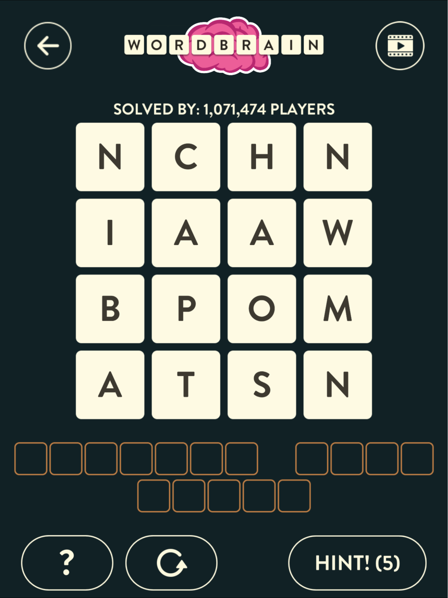

## About wordbrain
The smartphone app wordbrain is a puzzle game. The game presents users with a grid of letters, ranging in size 2x2 up to 5x5 and even larger.

Here is an example:


The user is given the pattern of word lengths. For this puzzle, the first word to be solved for is 7 letters, then the second word is 4 letters, and the final word is 5 letters.

The words must be spelled with adjacent letters, and as correct words are formed, the remaining letters drop down.

## Usage

`make`  

`./wordbrainsolver firstwordlist secondwordlist`

The firstwordlist is a file containing a small word list, and the secondwordlist is a file containing a more comprehensive word list.

### Example

`./wordbrainsolver small_word_list.txt large_word_list.txt < puzzles.txt > solutions.txt`

#### INPUT: puzzles.txt
```
hee
oqr
sua
*** ******
nchn
iaaw
bpom
atsn
**** ***** *** ****
vanmo
ipveo
toarr
tsmed
miipb
**** ******* ******* *******

```

#### OUTPUT: solutions.txt
square hoe 
.
bath man panic snow 
.
vitamin vampire bedroom opts 
vitamin vampire bedroom post 
vitamin vampire bedroom pots 
vitamin vampire bedroom stop 
.
